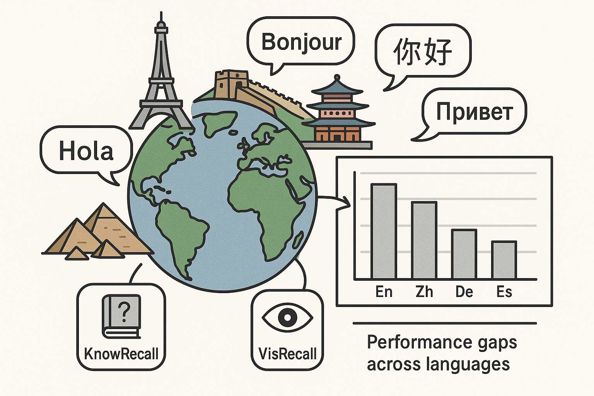
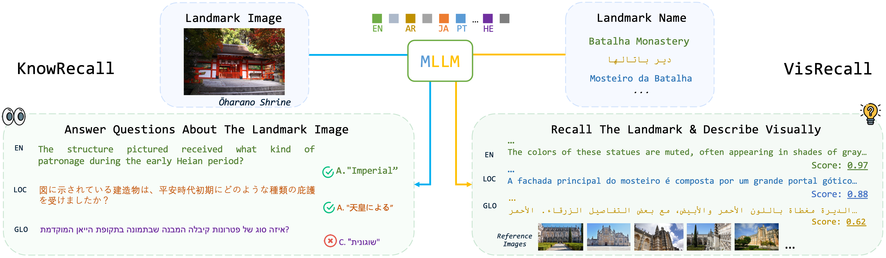
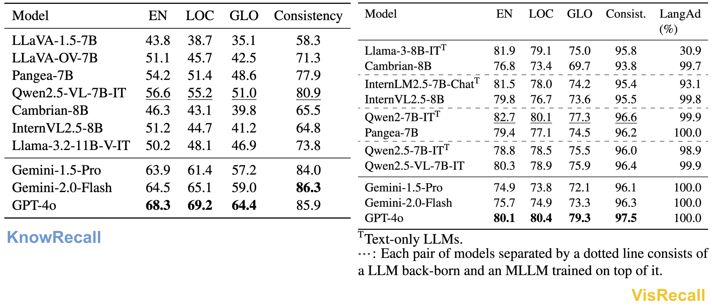

<div align="center" style="font-family: charter;">

<h1><i>Traveling Across Languages</i>:</br> Benchmarking Cross-Lingual Consistency in Multimodal LLMs</h1>


<br />

<a href="https://arxiv.org/abs/xxxx" target="_blank">
    
</a>
FIXME
<a href="https://huggingface.co/datasets/nlp-waseda/KnowRecall" target="_blank">
    
</a>
<a href="https://huggingface.co/datasets/nlp-waseda/VisRecall" target="_blank">
    
</a>

<div>
    <a href="https://www.conan1024hao.com/" target="_blank">Hao Wang</a><sup>1</sup>,</span>
    <a href="https://edwin334.github.io/" target="_blank">Pinzhi Huang</a><sup>2</sup>,</span>
    <a href="https://jihanyang.github.io/" target="_blank">Jihan Yang</a><sup>2</sup>,</span>
    <a href="https://www.sainingxie.com/" target="_blank">Saining Xie</a><sup>2</sup>,</span>
    <a href="https://www.nlp-waseda.jp" target="_blank">Daisuke Kawahara</a><sup>1,3</sup></span>
</div>

<div>
    <sup>1</sup>Waseda University&emsp;
    <sup>2</sup>New York University&emsp;
    <sup>3</sup>NII LLMC&emsp;
</div>

<p align="justify"><i>The rapid evolution of multimodal large language models (MLLMs) has significantly enhanced their real-world applications. However, achieving consistent performance across languages, especially when integrating cultural knowledge, remains a significant challenge. To better assess this issue, we introduce two new benchmarks: KnowRecall and VisRecall, which evaluate cross-lingual consistency in MLLMs. KnowRecall is a visual question answering benchmark designed to measure factual knowledge consistency in 15 languages, focusing on cultural and historical questions about global landmarks. VisRecall assesses visual memory consistency by asking models to describe landmark appearances in 9 languages without access to images. Experimental results reveal that state-of-the-art MLLMs, including proprietary ones, still struggle to achieve cross-lingual consistency. This underscores the need for more robust approaches that produce truly multilingual and culturally aware models.</i></p>

</div>

## Release
- `2025-05-22` :rocket: We released our two benchmarks and corresponding evaluation code.

## Contents
- [Release](#release)
- [Contents](#contents)
- [KnowRecall and VisRecall](#knowrecall-and-visrecall)
- [Results](#results)
- [RUN Your Own Evaluation](#run-your-own-evaluation)
  - [Installation](#installation)
  - [Evaluation](#evaluation)
- [Acknowledgement](#acknowledgement)
- [Citation](#citation)

## KnowRecall and VisRecall

**Overview:** In this paper, we introduced KnowRecall and VisRecall to systematically evaluate cross-lingual consistency in MLLMs.



**KnowRecall** evaluates the cross-lingual consistency of factual knowledge in MLLMs using a VQA setup, where the model answers questions about a given landmark image in 15 languages.

**VisRecall** measures the cross-lingual consistency of visual memory by assessing the quality of landmark descriptions generated in 9 languages, using CLIPScore for evaluation.

## Results

For **KnowRecall**, we use accuracy to measure model performance. Instead of evaluating performance in solely English and multilingual settings, we introduce a new evaluation scheme with three distinct settings: **EN** (questions are in English), **LOC** (questions are in the local language of each landmark), and **GLO** (the average performance across all languages except English and the local language).

We measure cross-lingual consistency using the ratio of correct predictions shared between two languages.
Let $n_x$ and $n_y$ denote the number of correct answers in languages $x$ and $y$, respectively, with $n_{xy}$ representing the number of answers correct in both, we define consistency as:

```math
\text{Consistency}_\text{K}(x,y)=\tfrac{1}{2}\left(
\frac{n_{xy}}{n_x}+\frac{n_{xy}}{n_y}
\right)
```

We compute the consistency of each local language with the other 14 languages and obtain the final score by averaging across all language pairs.

For **VisRecall**, we leverage CLIPScore for reference-free evaluation. We selected up to 20 images per landmark from GLDv2 and compute the CLIPScore between the generated description and each image. For non-English descriptions, we first translate them into English using Gemini before evaluation. The final score for each landmark-language pair is then calculated by averaging the CLIPScore across all selected images.

We define consistency for VisRecall as:

```math
\text{Consistency}_\text{V}(x,y)=\tfrac{1}{2}\left(
\frac{S}{\sum_i s_x^{(i)}}+\frac{S}{\sum_i s_y^{(i)}}
\right)
```

where $S=\sum\limits_{i} \min(s_x^{(i)}, s_y^{(i)})$, with $s_x^{(i)}$ and $s_y^{(i)}$ as the $i$ th landmark's CLIPScore in language $x$ and $y$.



## RUN Your Own Evaluation

### Installation

To evaluate most of the models featured in our paper, please use the following commands to set up your environment.
```bash
conda create --name eval_venv python=3.10
conda activate eval_venv

cd lmms-eval && pip install -e . && cd ..

git clone https://github.com/LLaVA-VL/LLaVA-NeXT
cd LLaVA-NeXT && pip install -e . && cd ..

pip install transformers==4.49.0 accelerate==1.6.0
pip install qwen-vl-utils[decord]==0.0.8
pip install flash-attn --no-build-isolation
pip install google-generativeai
```
To evaluate NYU’s Cambrian model, we highly recommend creating a separate environment due to its unique dependencies.
```bash
conda create --name cambrian_venv python=3.10
conda activate cambrian_venv

cd lmms-eval && pip install -e . && cd ..

git clone https://github.com/cambrian-mllm/cambrian
cd cambrian && pip install ".[gpu]" && cd ..

pip install transformers==4.37.0 accelerate==1.3.0 huggingface_hub==0.25.2
```

### Evaluation
Below is an example using Qwen2.5-VL to perform inference and evaluation on the KnowRecall and VisRecall benchmarks.

```bash
# KnowRecall
## inference command
python -m accelerate.commands.launch \
    --num_processes=8 \
    -m lmms_eval \
    --model qwen2_5_vl \
    --model_args "pretrained=Qwen/Qwen2.5-VL-7B-Instruct" \
    --tasks knowrecall \
    --batch_size 1 \
    --log_samples \
    --output_path ./logs/knowrecall/qwen2_5_vl

## evaluate command
python lmms-eval/tasks/knowrecall/evaluate.py --log_dir ./logs/knowrecall/qwen2_5_vl/LOG_DIR
```
```bash
# VisRecall
## download data from huggingface
cd visrecall
huggingface-cli download nlp-waseda/VisRecall --repo-type dataset --local-dir .
tar -xvzf images.tar.gz

## inference command
### currently only support single GPU
python generate.py --model_name_or_path "Qwen/Qwen2.5-VL-7B-Instruct"

## translate multilingual outputs into English
python translate_gemini.py --prediction_file predictions/Qwen2.5-VL-7B-Instruct.json

## evaluate command
python evaluate.py --prediction_file predictions/Qwen2.5-VL-7B-Instruct_translated_gemini.json
```

## Acknowledgement

KnowRecall's evaluation code is build upon [lmms-eval](https://github.com/EvolvingLMMs-Lab/lmms-eval). We acknowledge their team for providing this excellent toolkit for evaluating multimodal large language models.

## Citation
FIXME